# NovareHealth Login Flow Diagram

## Entry Points to Login Page

There are three ways a user can arrive at the login page:

### 1. Direct Access
User navigates directly to `/login` (e.g., clicks "Login" button in header).
- **No redirect context** - User will be routed based on their role after login
- **State variables**: None passed

### 2. Protected Route Redirect
User tries to access a protected page without being authenticated.
- **Example**: User visits `/patient/appointments` while logged out
- **ProtectedRoute component** intercepts and redirects to `/login`
- **State variables**:
  - `redirectFrom`: The original URL user was trying to access (e.g., `/patient/appointments`)
  - `redirectMessage`: "Please log in to access this page"
- **After login**: User is redirected back to `redirectFrom`

### 3. Booking Context (Guest Mode)
User starts a booking flow without being logged in.
- **Example**: User clicks "Book Now" on a doctor's profile
- **Booking context stored** in localStorage via `setBookingContext()`
- **State variables**:
  - `pendingBooking.returnUrl`: The booking page URL (e.g., `/doctors/5/book`)
  - `pendingBooking.doctorId`: The doctor being booked
- **After login**: User is redirected to `returnUrl`, booking context is cleared

---

## Complete Authentication Flow

```
┌─────────────────────────────────────────────────────────────────────────────────────┐
│                              USER ARRIVES AT LOGIN PAGE                              │
│                                  /login                                              │
└─────────────────────────────────────────────────────────────────────────────────────┘
                                        │
                    ┌───────────────────┼───────────────────┐
                    │                   │                   │
                    ▼                   ▼                   ▼
           ┌──────────────┐    ┌──────────────┐    ┌──────────────┐
           │   Direct     │    │  Protected   │    │   Booking    │
           │   Access     │    │    Route     │    │   Context    │
           │              │    │   Redirect   │    │   (Guest)    │
           └──────────────┘    └──────────────┘    └──────────────┘
                    │                   │                   │
                    │          redirectFrom +       pendingBooking
                    │          redirectMessage        returnUrl
                    │                   │                   │
                    └───────────────────┼───────────────────┘
                                        │
                                        ▼
┌─────────────────────────────────────────────────────────────────────────────────────┐
│                            STEP 1: PHONE NUMBER ENTRY                                │
├─────────────────────────────────────────────────────────────────────────────────────┤
│  • User enters 9-digit phone number (Mozambique format)                             │
│  • Real-time validation (prefix: 82, 83, 84, 85, 86, 87)                           │
│  • Phone normalized with country code (+258)                                         │
└─────────────────────────────────────────────────────────────────────────────────────┘
                                        │
                                        ▼
                              ┌──────────────────┐
                              │  handleSendOTP() │
                              │                  │
                              │ POST /auth/otp   │
                              │   /send-phone    │
                              └──────────────────┘
                                        │
                         ┌──────────────┴──────────────┐
                         │                             │
                         ▼                             ▼
                   ┌──────────┐                 ┌──────────────┐
                   │ SUCCESS  │                 │    ERROR     │
                   │          │                 │              │
                   │ OTP Sent │                 │ Show Message │
                   └──────────┘                 └──────────────┘
                         │                             │
                         │                             │
                         ▼                             │
┌─────────────────────────────────────────────────────────────────────────────────────┐
│                              STEP 2: OTP VERIFICATION                                │
├─────────────────────────────────────────────────────────────────────────────────────┤
│  • 6 individual input boxes for OTP                                                  │
│  • Auto-focus next input on digit entry                                              │
│  • Paste support (complete 6-digit paste)                                            │
│  • Auto-submit when 6 digits entered                                                 │
│  • Resend OTP option available                                                       │
└─────────────────────────────────────────────────────────────────────────────────────┘
                                        │
                                        ▼
                             ┌───────────────────┐
                             │ handleVerifyOTP() │
                             │                   │
                             │ POST /auth/otp    │
                             │     /verify       │
                             └───────────────────┘
                                        │
                         ┌──────────────┴──────────────┐
                         │                             │
                         ▼                             ▼
                   ┌──────────┐                 ┌──────────────┐
                   │ SUCCESS  │                 │    ERROR     │
                   │          │                 │              │
                   │ Get User │                 │ Clear OTP    │
                   │ + Tokens │                 │ Show Error   │
                   └──────────┘                 │ Focus First  │
                         │                      └──────────────┘
                         │
                         ▼
┌─────────────────────────────────────────────────────────────────────────────────────┐
│                           POST-LOGIN REDIRECT LOGIC                                  │
└─────────────────────────────────────────────────────────────────────────────────────┘
                                        │
         ┌──────────────────────────────┼──────────────────────────────┐
         │                              │                              │
         ▼                              ▼                              ▼
┌─────────────────┐          ┌─────────────────┐          ┌─────────────────┐
│ pendingBooking? │          │   returnUrl?    │          │  redirectFrom?  │
│   (Guest Mode)  │          │ (Login Prompt)  │          │(Protected Route)│
└─────────────────┘          └─────────────────┘          └─────────────────┘
         │                              │                              │
    YES  │                         YES  │                         YES  │
         ▼                              ▼                              ▼
┌─────────────────┐          ┌─────────────────┐          ┌─────────────────┐
│ Navigate to     │          │ Navigate to     │          │ Navigate to     │
│ bookingReturnUrl│          │ returnUrl       │          │ redirectFrom    │
│                 │          │                 │          │                 │
│ Clear booking   │          │ (e.g., /doctors │          │ (original page) │
│ context         │          │  /5/book)       │          │                 │
└─────────────────┘          └─────────────────┘          └─────────────────┘
         │                              │                              │
         └──────────────────────────────┴──────────────────────────────┘
                                        │
                                   NO to all
                                        │
                                        ▼
┌─────────────────────────────────────────────────────────────────────────────────────┐
│                            ROLE-BASED REDIRECT                                       │
└─────────────────────────────────────────────────────────────────────────────────────┘
                                        │
              ┌─────────────────────────┼─────────────────────────┐
              │                         │                         │
              ▼                         ▼                         ▼
     ┌────────────────┐        ┌────────────────┐        ┌────────────────┐
     │  role: doctor  │        │ role: admin/   │        │ role: patient  │
     │                │        │ super_admin    │        │                │
     └────────────────┘        └────────────────┘        └────────────────┘
              │                         │                         │
              ▼                         ▼                         ▼
     ┌────────────────┐        ┌────────────────┐        ┌────────────────┐
     │ GET /doctors   │        │   Navigate to  │        │   Navigate to  │
     │     /me        │        │                │        │                │
     │                │        │ /admin/        │        │ /patient/      │
     │ Check Profile  │        │   dashboard    │        │   dashboard    │
     └────────────────┘        └────────────────┘        └────────────────┘
              │
    ┌─────────┴─────────┐
    │                   │
    ▼                   ▼
┌────────┐         ┌────────┐
│ 200 OK │         │  404   │
│        │         │  Error │
└────────┘         └────────┘
    │                   │
    ▼                   ▼
┌─────────────────────────────────────┐   ┌─────────────────────────────────────┐
│      Check verification_status       │   │         No doctor profile           │
├─────────────────────────────────────┤   ├─────────────────────────────────────┤
│                                     │   │                                     │
│  verified ──► /doctor/dashboard     │   │     Navigate to /register/doctor    │
│                                     │   │                                     │
│  pending ───► /doctor/verification  │   │     (Complete registration)         │
│               -pending              │   │                                     │
│                                     │   │                                     │
│  rejected ──► /doctor/verification  │   │                                     │
│               -pending              │   │                                     │
│                                     │   │                                     │
└─────────────────────────────────────┘   └─────────────────────────────────────┘


## Use Cases Summary

### UC1: Direct Login (Patient)
```
User → /login → Phone → OTP → /patient/dashboard
```

### UC2: Direct Login (Admin)
```
User → /login → Phone → OTP → /admin/dashboard
```

### UC3: Direct Login (Verified Doctor)
```
User → /login → Phone → OTP → Check /doctors/me → verified → /doctor/dashboard
```

### UC4: Direct Login (Pending Doctor)
```
User → /login → Phone → OTP → Check /doctors/me → pending → /doctor/verification-pending
```

### UC5: Direct Login (New Doctor - No Profile)
```
User → /login → Phone → OTP → Check /doctors/me → 404 → /register/doctor
```

### UC6: Protected Route Redirect
```
User → /patient/appointments (not logged in)
     → Redirect to /login with redirectFrom=/patient/appointments
     → Phone → OTP
     → Navigate back to /patient/appointments
```

### UC7: Booking Flow (Guest Mode)
```
User → /doctors/5 → "Book Now" (not logged in)
     → Store booking context (doctorId, returnUrl)
     → Redirect to /login
     → Phone → OTP
     → Navigate to returnUrl (booking page)
     → Clear booking context
```

### UC8: Login Prompt Modal
```
User → /doctors → Click "Book" on doctor card
     → Show LoginPromptModal with returnUrl
     → User clicks "Login"
     → /login with returnUrl=/doctors/5/book
     → Phone → OTP
     → Navigate to /doctors/5/book
```

### UC9: OTP Resend
```
User → /login → Phone → OTP sent
     → Didn't receive? → Click "Resend OTP"
     → New OTP sent
```

### UC10: Invalid OTP
```
User → /login → Phone → OTP
     → Enter wrong OTP → Error: "Invalid OTP"
     → Clear inputs, focus first box
     → Retry
```

### UC11: Phone Validation Error
```
User → /login → Enter invalid phone (wrong prefix)
     → Show validation error
     → Button disabled until valid
```

## State Variables

| Variable | Type | Purpose |
|----------|------|---------|
| `step` | 'phone' \| 'otp' | Current step in login flow |
| `phone` | string | Normalized phone number (+258XXXXXXXXX) |
| `phoneDisplay` | string | Formatted display (XX XXX XXXX) |
| `otpValues` | string[] | 6-element array for OTP digits |
| `isLoading` | boolean | Loading state for API calls |
| `error` | string | Error message to display |
| `redirectFrom` | string | Original protected route |
| `redirectMessage` | string | Message shown on redirect |
| `returnUrl` | string | URL to return after login |
| `pendingBooking` | object | Stored booking context |

## API Endpoints

| Endpoint | Method | Purpose |
|----------|--------|---------|
| `/api/v1/auth/otp/send-phone` | POST | Send OTP to phone |
| `/api/v1/auth/otp/verify` | POST | Verify OTP, get tokens |
| `/api/v1/doctors/me` | GET | Get current doctor profile |

## Response on Successful Login

```json
{
  "user": {
    "id": 1,
    "email": "user@example.com",
    "phone": "+258841234567",
    "first_name": "John",
    "last_name": "Doe",
    "role": "patient"
  },
  "access_token": "eyJ...",
  "refresh_token": "eyJ..."
}
```

---

## Sequence Diagrams

### Sequence 1: Direct Login (Patient)

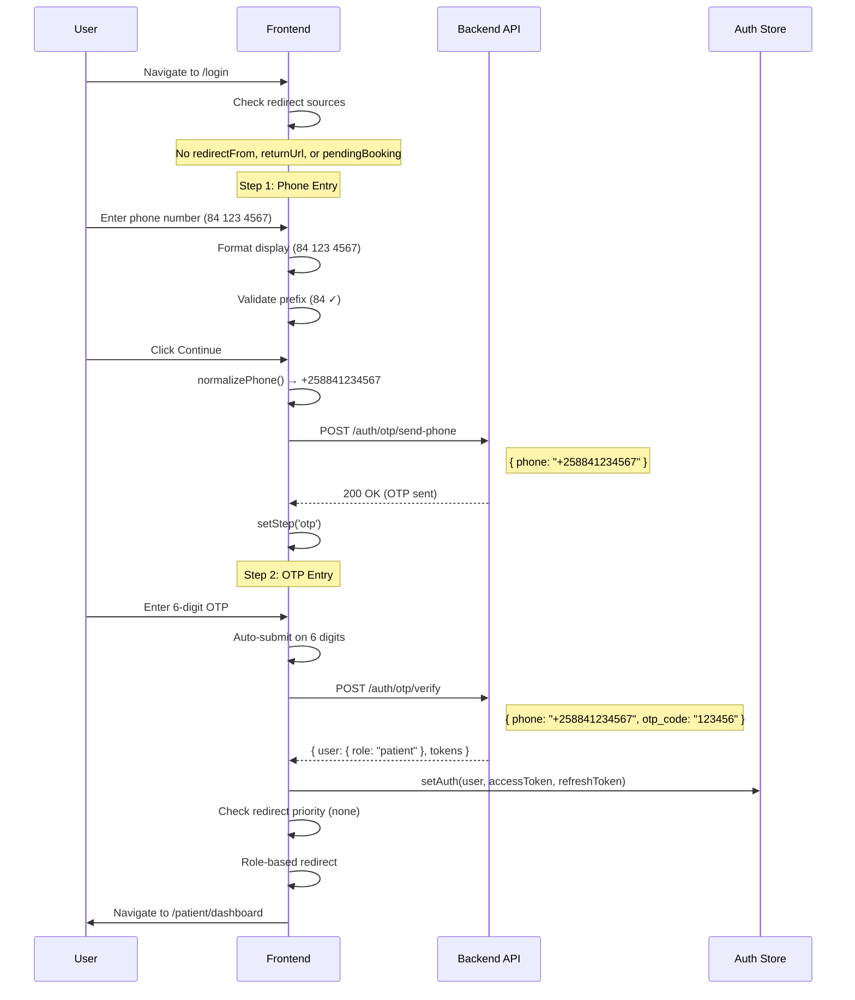

### Sequence 2: Protected Route Redirect

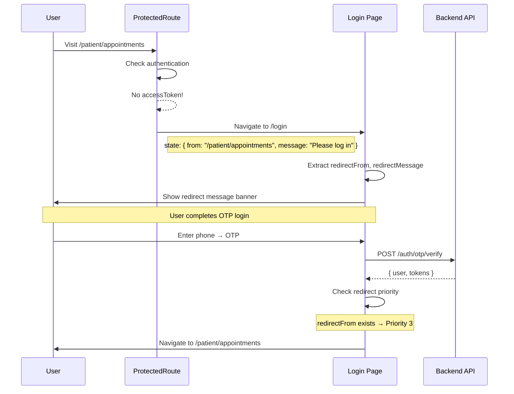

### Sequence 3: Guest Booking Flow

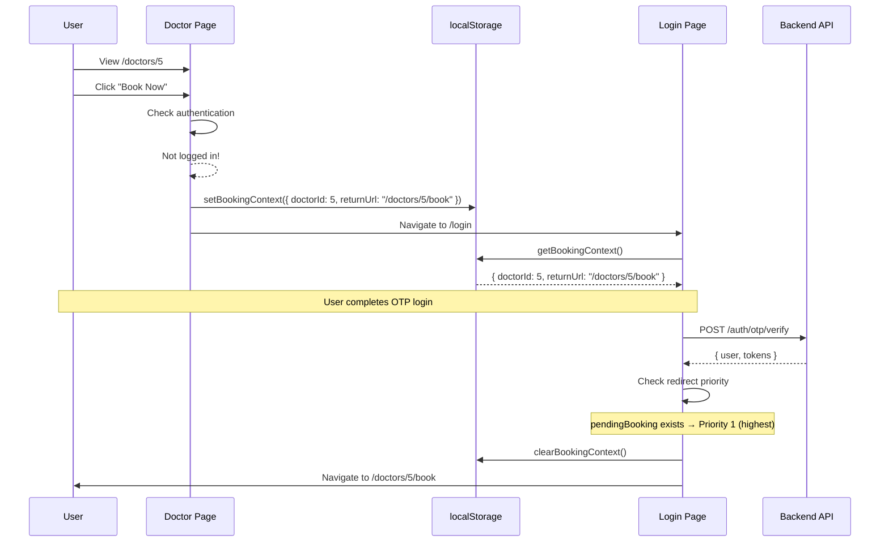

### Sequence 4: Login Prompt Modal Flow

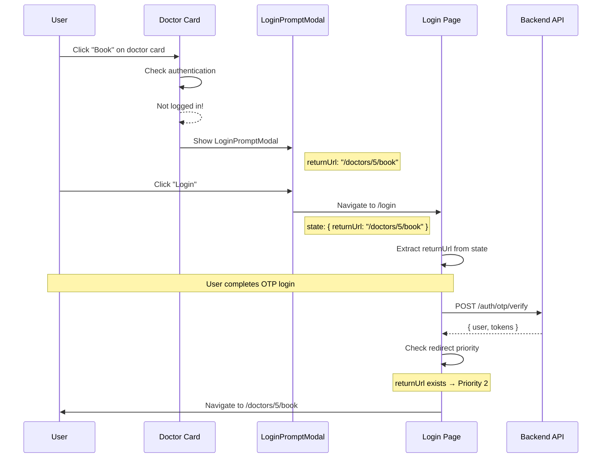

### Sequence 5: Doctor Login (Verified)

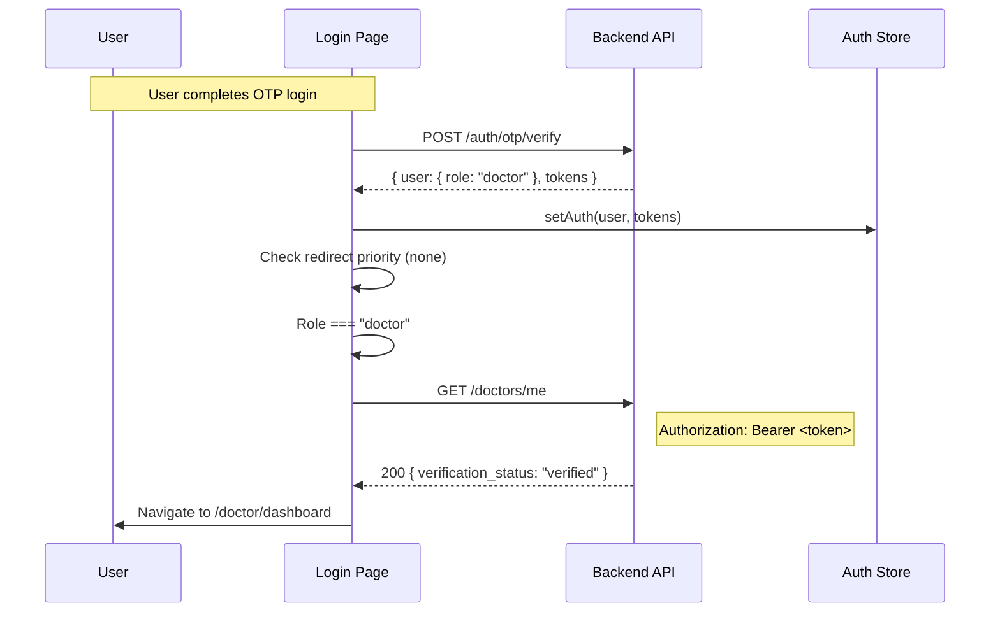

### Sequence 6: Doctor Login (Pending Verification)

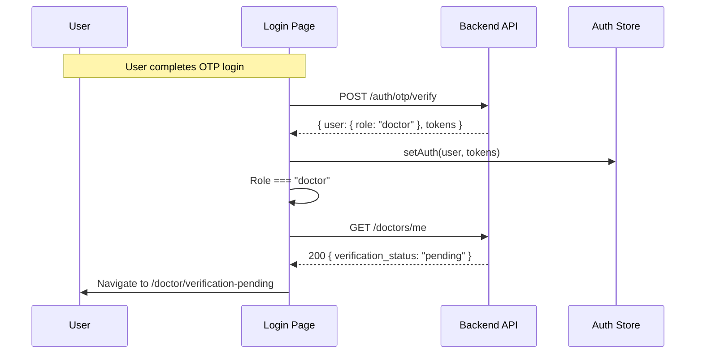

### Sequence 7: Doctor Login (No Profile - New Doctor)

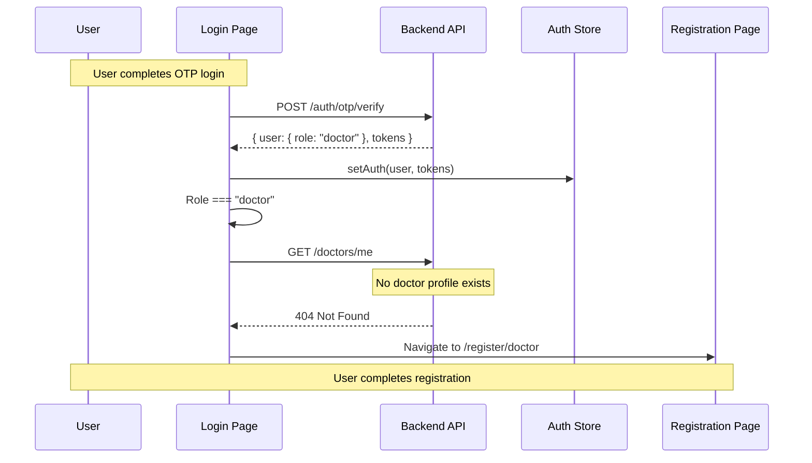

### Sequence 8: OTP Paste Flow

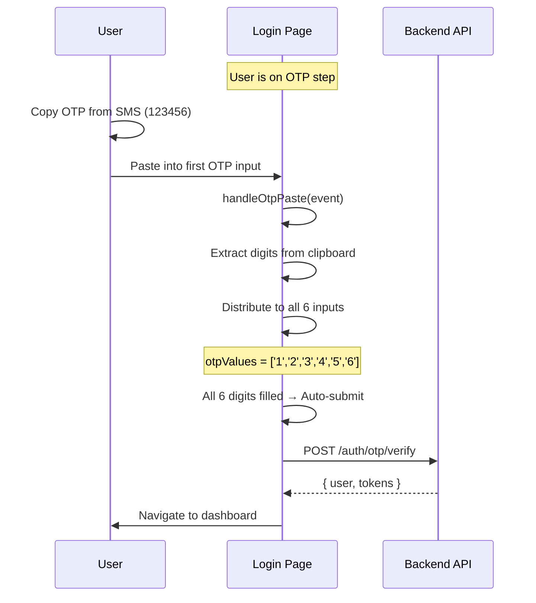

### Sequence 9: OTP Resend

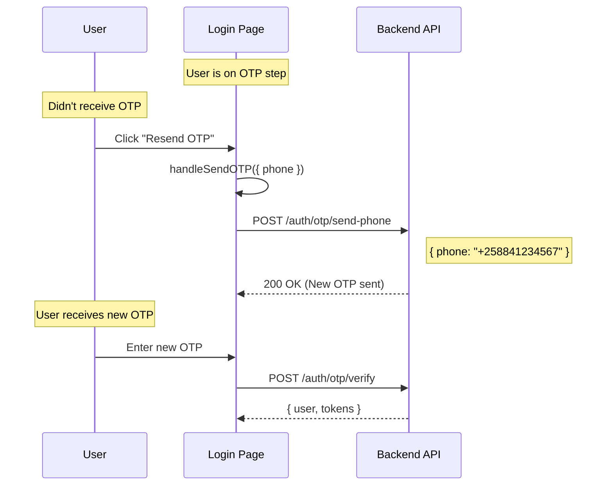

### Sequence 10: Invalid OTP Error

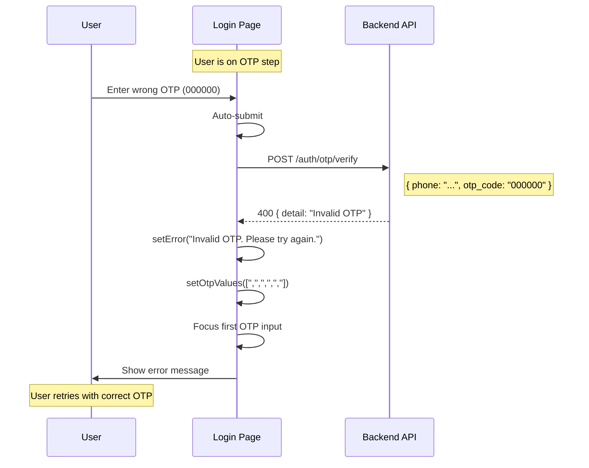

### Sequence 11: Phone Validation

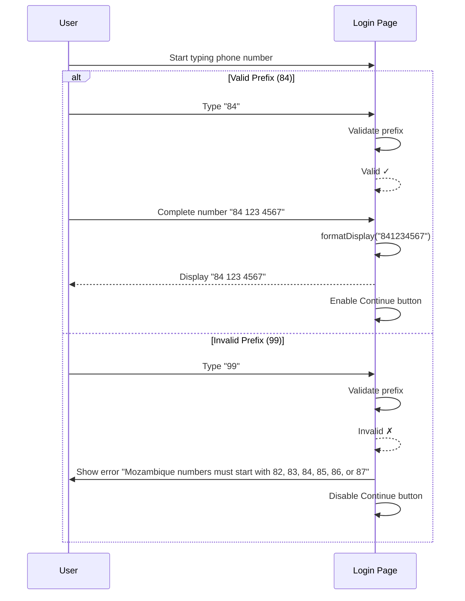

---

## Component Interaction Diagram

```
┌─────────────────────────────────────────────────────────────────────────────────────┐
│                               LoginPage Component                                    │
├─────────────────────────────────────────────────────────────────────────────────────┤
│                                                                                      │
│  ┌─────────────────┐     ┌─────────────────┐     ┌─────────────────┐               │
│  │  useAuthStore   │     │ useLocation()   │     │   authService   │               │
│  │                 │     │                 │     │                 │               │
│  │  - setAuth()    │     │  - state.from   │     │  - sendOTPPhone │               │
│  │                 │     │  - state.message│     │  - verifyOTP    │               │
│  │                 │     │  - state.returnUrl    │                 │               │
│  └────────┬────────┘     └────────┬────────┘     └────────┬────────┘               │
│           │                       │                       │                         │
│           │              ┌────────┴────────┐              │                         │
│           │              │                 │              │                         │
│           │              ▼                 ▼              │                         │
│           │     ┌──────────────┐  ┌──────────────┐        │                         │
│           │     │ redirectFrom │  │ returnUrl    │        │                         │
│           │     │ (protected)  │  │ (modal)      │        │                         │
│           │     └──────────────┘  └──────────────┘        │                         │
│           │              │                 │              │                         │
│           │              └────────┬────────┘              │                         │
│           │                       │                       │                         │
│           └───────────────────────┼───────────────────────┘                         │
│                                   │                                                  │
│                                   ▼                                                  │
│  ┌──────────────────────────────────────────────────────────────────────────────┐   │
│  │                              State Management                                 │   │
│  │                                                                               │   │
│  │  step │ phone │ phoneDisplay │ otpValues │ isLoading │ error                 │   │
│  └──────────────────────────────────────────────────────────────────────────────┘   │
│                                   │                                                  │
│           ┌───────────────────────┼───────────────────────┐                         │
│           │                       │                       │                         │
│           ▼                       ▼                       ▼                         │
│  ┌─────────────────┐     ┌─────────────────┐     ┌─────────────────┐               │
│  │   Phone Step    │     │    OTP Step     │     │ getBookingContext│              │
│  │                 │     │                 │     │                 │               │
│  │  - phoneForm    │     │  - otpRefs      │     │  - pendingBooking│              │
│  │  - handlePhone  │     │  - handleOtp    │     │  - clearBooking │               │
│  │    Change       │     │    Change       │     │    Context      │               │
│  │  - handleSend   │     │  - handleOtp    │     │                 │               │
│  │    OTP          │     │    Paste        │     │                 │               │
│  │                 │     │  - handleVerify │     │                 │               │
│  │                 │     │    OTP          │     │                 │               │
│  └─────────────────┘     └─────────────────┘     └─────────────────┘               │
│                                                                                      │
└─────────────────────────────────────────────────────────────────────────────────────┘
```

---

## Redirect Priority Flowchart

```
┌─────────────────────────────────────────────────────────────────────────────────────┐
│                          POST-LOGIN REDIRECT DECISION                                │
└─────────────────────────────────────────────────────────────────────────────────────┘
                                        │
                                        ▼
                          ┌──────────────────────────┐
                          │  pendingBooking exists?  │
                          └──────────────────────────┘
                                        │
                         ┌──────────────┴──────────────┐
                         │                             │
                        YES                           NO
                         │                             │
                         ▼                             ▼
              ┌─────────────────────┐      ┌──────────────────────────┐
              │  PRIORITY 1         │      │  returnUrl exists?       │
              │                     │      └──────────────────────────┘
              │  Navigate to        │                  │
              │  pendingBooking     │       ┌──────────┴──────────┐
              │  .returnUrl         │       │                     │
              │                     │      YES                   NO
              │  Clear booking      │       │                     │
              │  context            │       ▼                     ▼
              └─────────────────────┘  ┌──────────────┐  ┌──────────────────────────┐
                                       │  PRIORITY 2  │  │  redirectFrom exists?    │
                                       │              │  └──────────────────────────┘
                                       │  Navigate to │           │
                                       │  returnUrl   │  ┌────────┴────────┐
                                       └──────────────┘  │                 │
                                                        YES               NO
                                                         │                 │
                                                         ▼                 ▼
                                              ┌──────────────┐  ┌──────────────────┐
                                              │  PRIORITY 3  │  │  PRIORITY 4      │
                                              │              │  │                  │
                                              │  Navigate to │  │  Role-based      │
                                              │  redirectFrom│  │  redirect        │
                                              └──────────────┘  └──────────────────┘
                                                                        │
                                                         ┌──────────────┼──────────────┐
                                                         │              │              │
                                                         ▼              ▼              ▼
                                                    ┌────────┐    ┌────────┐    ┌────────┐
                                                    │ doctor │    │ admin  │    │patient │
                                                    └────────┘    └────────┘    └────────┘
                                                         │              │              │
                                                         ▼              ▼              ▼
                                                  Check /doctors/me   /admin/     /patient/
                                                         │           dashboard    dashboard
                                              ┌──────────┼──────────┐
                                              │          │          │
                                              ▼          ▼          ▼
                                          verified   pending     404
                                              │          │          │
                                              ▼          ▼          ▼
                                          /doctor/  /doctor/    /register/
                                          dashboard verification  doctor
                                                    -pending
```
