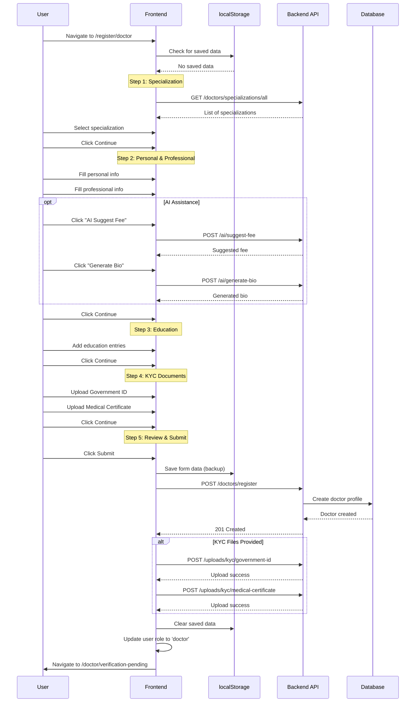
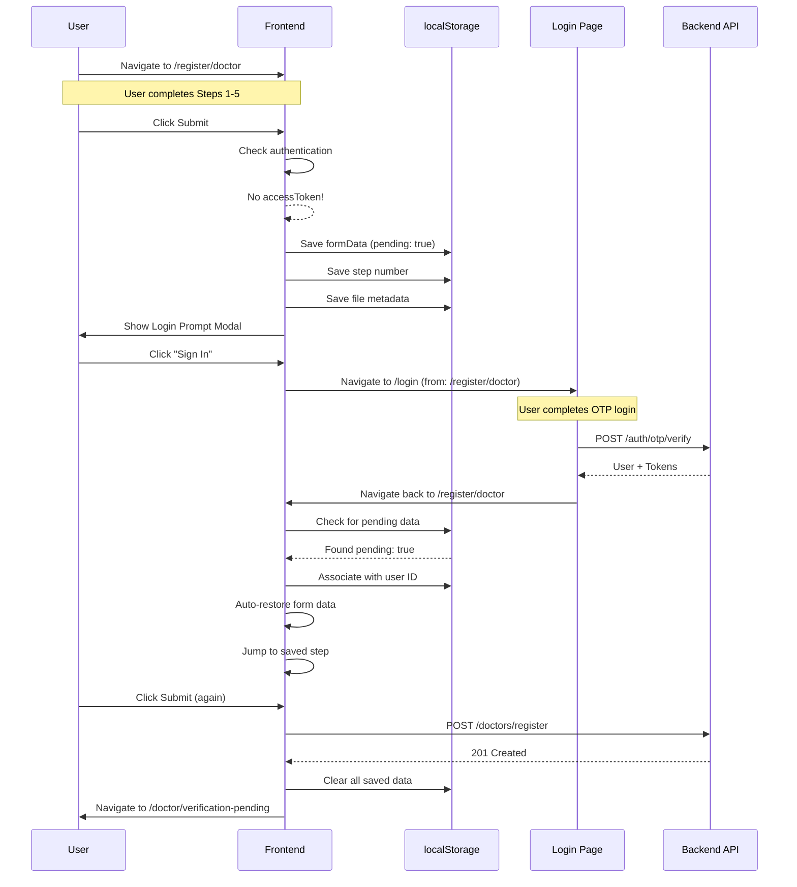
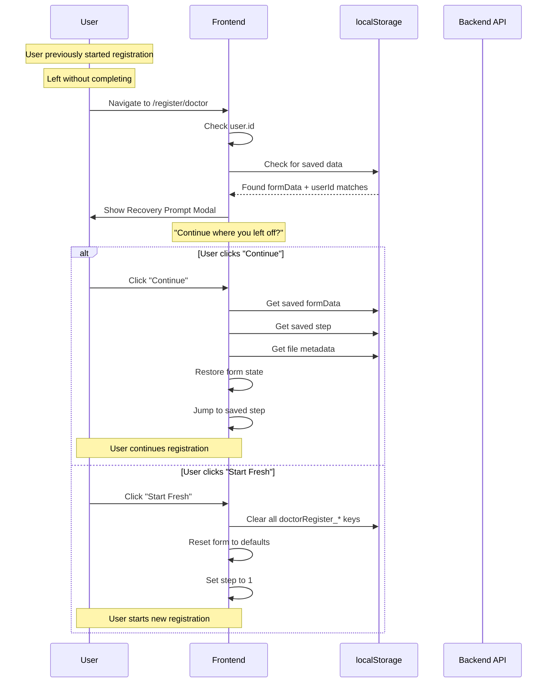
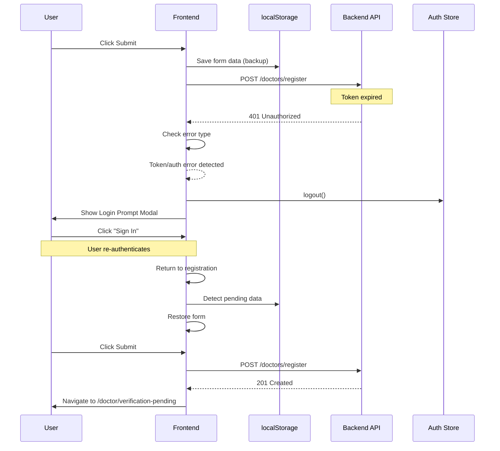
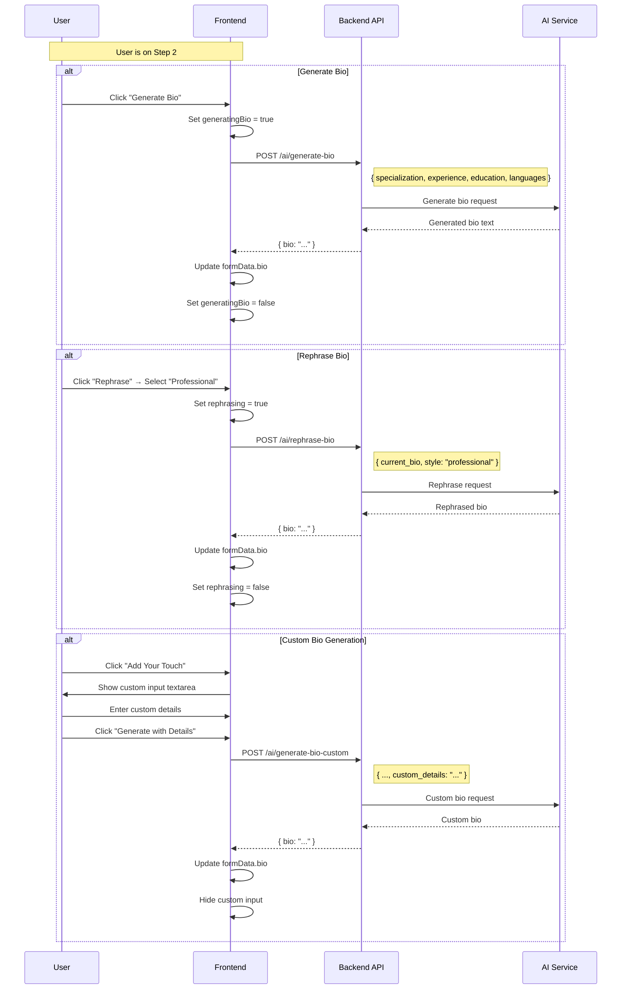
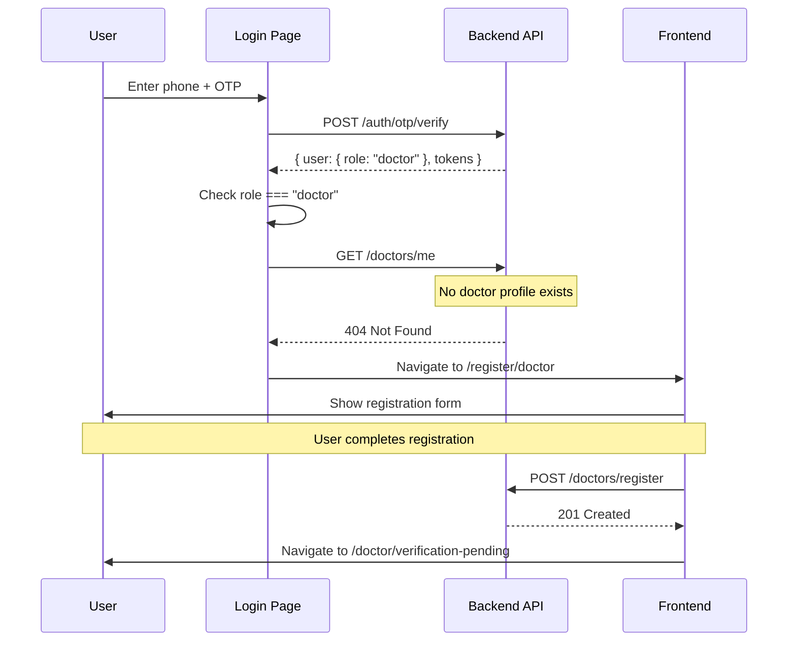

# NovareHealth Doctor Registration Flow Diagram

## Entry Points to Registration

There are three ways a user can arrive at the doctor registration page:

### 1. Direct Access
User navigates directly to `/register/doctor` (e.g., clicks "Join as Doctor" link).
- **No prior context** - User starts fresh registration
- **May or may not be logged in**

### 2. Post-Login Redirect (New Doctor)
User logs in with `role: doctor` but has no doctor profile.
- **Login flow checks** `GET /doctors/me` → returns 404
- **Redirects to** `/register/doctor` to complete profile

### 3. Recovery Flow
User has incomplete registration data from a previous session.
- **Data stored in localStorage** with user association
- **Recovery prompt shown** on return visit

---

## Complete Registration Flow

```
┌─────────────────────────────────────────────────────────────────────────────────────┐
│                         USER ARRIVES AT REGISTRATION PAGE                           │
│                              /register/doctor                                        │
└─────────────────────────────────────────────────────────────────────────────────────┘
                                        │
                    ┌───────────────────┼───────────────────┐
                    │                   │                   │
                    ▼                   ▼                   ▼
           ┌──────────────┐    ┌──────────────┐    ┌──────────────┐
           │   Direct     │    │  Post-Login  │    │   Recovery   │
           │   Access     │    │   Redirect   │    │    Flow      │
           │              │    │ (New Doctor) │    │              │
           └──────────────┘    └──────────────┘    └──────────────┘
                    │                   │                   │
                    │            from /login         localStorage
                    │            (404 on /me)        pending data
                    │                   │                   │
                    └───────────────────┴───────────────────┘
                                        │
                                        ▼
                          ┌──────────────────────────┐
                          │   Check for Saved Data   │
                          │   in localStorage        │
                          └──────────────────────────┘
                                        │
                         ┌──────────────┴──────────────┐
                         │                             │
                         ▼                             ▼
              ┌─────────────────────┐      ┌─────────────────────┐
              │   Saved Data Found  │      │    No Saved Data    │
              │   (Same User OR     │      │                     │
              │    Pending Login)   │      │   Start Fresh       │
              └─────────────────────┘      └─────────────────────┘
                         │                             │
                         ▼                             │
              ┌─────────────────────┐                  │
              │  Show Recovery      │                  │
              │  Prompt Modal       │                  │
              │                     │                  │
              │  "Continue where    │                  │
              │   you left off?"    │                  │
              └─────────────────────┘                  │
                         │                             │
              ┌──────────┴──────────┐                  │
              │                     │                  │
              ▼                     ▼                  │
      ┌──────────────┐     ┌──────────────┐           │
      │   Recover    │     │ Start Fresh  │           │
      │   Data       │     │ Clear Data   │           │
      └──────────────┘     └──────────────┘           │
              │                     │                  │
              └─────────────────────┴──────────────────┘
                                        │
                                        ▼
┌─────────────────────────────────────────────────────────────────────────────────────┐
│                              STEP 1: SPECIALIZATION                                  │
├─────────────────────────────────────────────────────────────────────────────────────┤
│  • Select medical specialization from grid                                          │
│  • AI Tips panel shows personalized guidance                                         │
│  • Continue button enabled when specialization selected                              │
└─────────────────────────────────────────────────────────────────────────────────────┘
                                        │
                                        ▼
┌─────────────────────────────────────────────────────────────────────────────────────┐
│                           STEP 2: PERSONAL & PROFESSIONAL                            │
├─────────────────────────────────────────────────────────────────────────────────────┤
│  Personal Information:                                                               │
│  • First Name, Last Name, Email                                                      │
│                                                                                      │
│  Professional Information:                                                           │
│  • License Number, Years of Experience                                               │
│  • Consultation Fee (AI Suggest available)                                           │
│  • Consultation Duration                                                             │
│  • Bio (AI Generate / Rephrase / Custom available)                                   │
│  • Languages Spoken                                                                  │
└─────────────────────────────────────────────────────────────────────────────────────┘
                                        │
                                        ▼
┌─────────────────────────────────────────────────────────────────────────────────────┐
│                          STEP 3: EDUCATION & QUALIFICATIONS                          │
├─────────────────────────────────────────────────────────────────────────────────────┤
│  • Add multiple education entries                                                    │
│  • Quick-select common degrees (MBBS, MD, etc.)                                      │
│  • Institution and Year for each entry                                               │
│  • At least one education entry required                                             │
└─────────────────────────────────────────────────────────────────────────────────────┘
                                        │
                                        ▼
┌─────────────────────────────────────────────────────────────────────────────────────┐
│                             STEP 4: KYC DOCUMENTS                                    │
├─────────────────────────────────────────────────────────────────────────────────────┤
│  • Government ID upload (optional but recommended)                                   │
│  • Medical Certificate upload (optional but recommended)                             │
│  • File metadata saved for recovery                                                  │
└─────────────────────────────────────────────────────────────────────────────────────┘
                                        │
                                        ▼
┌─────────────────────────────────────────────────────────────────────────────────────┐
│                            STEP 5: REVIEW & SUBMIT                                   │
├─────────────────────────────────────────────────────────────────────────────────────┤
│  • Review all entered information                                                    │
│  • Edit buttons to go back to specific steps                                         │
│  • Submit Registration button                                                        │
└─────────────────────────────────────────────────────────────────────────────────────┘
                                        │
                                        ▼
                          ┌──────────────────────────┐
                          │    handleSubmit()        │
                          └──────────────────────────┘
                                        │
                         ┌──────────────┴──────────────┐
                         │                             │
                         ▼                             ▼
              ┌─────────────────────┐      ┌─────────────────────┐
              │   User Logged In    │      │  User NOT Logged In │
              │   (has accessToken) │      │                     │
              └─────────────────────┘      └─────────────────────┘
                         │                             │
                         │                             ▼
                         │              ┌──────────────────────────┐
                         │              │  Save Form Data to       │
                         │              │  localStorage            │
                         │              │  (pending: true)         │
                         │              │                          │
                         │              │  Show Login Prompt Modal │
                         │              └──────────────────────────┘
                         │                             │
                         │                             ▼
                         │              ┌──────────────────────────┐
                         │              │  User clicks "Sign In"   │
                         │              │  → Navigate to /login    │
                         │              │  with from: /register/   │
                         │              │       doctor             │
                         │              └──────────────────────────┘
                         │                             │
                         │                             ▼
                         │              ┌──────────────────────────┐
                         │              │  After login, return to  │
                         │              │  /register/doctor        │
                         │              │                          │
                         │              │  Pending data detected   │
                         │              │  → Auto-restore form     │
                         │              └──────────────────────────┘
                         │                             │
                         └─────────────┬───────────────┘
                                       │
                                       ▼
                          ┌──────────────────────────┐
                          │  POST /doctors/register  │
                          │                          │
                          │  Headers:                │
                          │  Authorization: Bearer   │
                          └──────────────────────────┘
                                        │
                         ┌──────────────┴──────────────┐
                         │                             │
                         ▼                             ▼
                   ┌──────────┐                 ┌──────────────┐
                   │ SUCCESS  │                 │    ERROR     │
                   │  201     │                 │              │
                   └──────────┘                 └──────────────┘
                         │                             │
                         ▼                             ▼
              ┌─────────────────────┐      ┌─────────────────────┐
              │  Upload KYC Files   │      │  Check Error Type   │
              │  (if provided)      │      │                     │
              │                     │      │  401/Token Error?   │
              │  POST /uploads/kyc/ │      │  → Show Login Modal │
              │   government-id     │      │                     │
              │  POST /uploads/kyc/ │      │  Other Error?       │
              │   medical-certificate│     │  → Show Error Msg   │
              └─────────────────────┘      └─────────────────────┘
                         │
                         ▼
              ┌─────────────────────┐
              │  Update User Role   │
              │  to 'doctor' in     │
              │  Auth Store         │
              └─────────────────────┘
                         │
                         ▼
              ┌─────────────────────┐
              │  Clear Saved Data   │
              │  from localStorage  │
              └─────────────────────┘
                         │
                         ▼
              ┌─────────────────────┐
              │  Navigate to        │
              │  /doctor/           │
              │  verification-pending│
              └─────────────────────┘


## Use Cases Summary

### UC1: New Doctor - Direct Registration (Logged In)
```
User → /register/doctor → Complete Steps 1-5 → Submit → /doctor/verification-pending
```

### UC2: New Doctor - Direct Registration (Not Logged In)
```
User → /register/doctor → Complete Steps 1-5 → Submit 
     → Login Prompt Modal → Sign In → /login
     → Login Success → Return to /register/doctor
     → Auto-restore form → Submit → /doctor/verification-pending
```

### UC3: Post-Login Redirect (New Doctor with no profile)
```
User → /login → Phone → OTP → role: doctor
     → Check /doctors/me → 404 Not Found
     → Redirect to /register/doctor → Complete registration
```

### UC4: Recovery Flow (Same User)
```
User → /register/doctor → Partial completion → Leave page
     → Return later (same user logged in)
     → Recovery Prompt: "Continue where you left off?"
     → Click "Continue" → Form restored → Complete registration
```

### UC5: Recovery Flow (Start Fresh)
```
User → /register/doctor → Partial completion → Leave page
     → Return later
     → Recovery Prompt: "Continue where you left off?"
     → Click "Start Fresh" → Clear data → Begin new registration
```

### UC6: Session Expired During Submit
```
User → /register/doctor → Complete Steps 1-5 → Submit
     → API returns 401 (token expired)
     → Show Login Prompt Modal → User re-authenticates
     → Return and retry submission
```

### UC7: AI-Assisted Registration
```
User → /register/doctor → Step 2
     → Click "AI Suggest Fee" → Fee auto-filled
     → Click "Generate Bio" → Bio auto-generated
     → Click "Rephrase (Professional)" → Bio refined
     → Continue with AI-enhanced profile
```

### UC8: Incomplete Fields Validation
```
User → /register/doctor → Step 2 → Missing required fields
     → Validation warning shown
     → Continue button disabled
     → User fills required fields → Continue enabled
```

### UC9: Guest User Conversion
```
Guest → Browsing doctors → Clicks "Join as Doctor"
      → /register/doctor → Fills form → Submit
      → Login Prompt → Creates account via phone OTP
      → Returns with pending data → Registration completes
```

### UC10: Multiple Education Entries
```
User → Step 3 → Add MBBS → Add MD Cardiology → Add Fellowship
     → All entries shown → Can remove any entry
     → At least one required to continue
```

---

## State Variables

| Variable | Type | Purpose |
|----------|------|---------|
| `step` | number (1-5) | Current registration step |
| `formData` | object | All form field values |
| `specializations` | array | Available medical specializations |
| `governmentId` | File \| null | Government ID file for upload |
| `medicalCertificate` | File \| null | Medical certificate file for upload |
| `loading` | boolean | Submit in progress |
| `error` | string | Error message to display |
| `showLoginPrompt` | boolean | Show login modal |
| `showRecoveryPrompt` | boolean | Show recovery modal |

---

## localStorage Keys

| Key | Purpose |
|-----|---------|
| `doctorRegister_formData` | Serialized form data (JSON) |
| `doctorRegister_step` | Current step number |
| `doctorRegister_userId` | User ID (for same-user validation) |
| `doctorRegister_pending` | Flag for pre-login submissions |
| `doctorRegister_govIdMeta` | Government ID file metadata |
| `doctorRegister_medCertMeta` | Medical certificate file metadata |

---

## API Endpoints

| Endpoint | Method | Purpose |
|----------|--------|---------|
| `/api/v1/doctors/specializations/all` | GET | Fetch all specializations |
| `/api/v1/doctors/register` | POST | Submit doctor registration |
| `/api/v1/uploads/kyc/government-id` | POST | Upload government ID |
| `/api/v1/uploads/kyc/medical-certificate` | POST | Upload medical certificate |
| `/api/v1/ai/registration-tips` | POST | Get AI tips for current step |
| `/api/v1/ai/generate-bio` | POST | Generate bio with AI |
| `/api/v1/ai/rephrase-bio` | POST | Rephrase bio with style |
| `/api/v1/ai/suggest-fee` | POST | Get AI-suggested fee |
| `/api/v1/ai/chat` | POST | AI chat assistance |

---

## Registration Request Payload

```json
{
  "first_name": "John",
  "last_name": "Smith",
  "email": "dr.john@example.com",
  "specialization_id": 5,
  "license_number": "MD-12345",
  "experience_years": 10,
  "bio": "Board-certified cardiologist with 10 years of experience...",
  "consultation_fee": 500.00,
  "consultation_duration": 30,
  "languages": ["English", "Portuguese"],
  "education": [
    {
      "degree": "MBBS",
      "institution": "University of Maputo",
      "year": "2010"
    },
    {
      "degree": "MD Cardiology",
      "institution": "Medical Academy",
      "year": "2014"
    }
  ]
}
```

---

## Post-Registration Flow

```
Registration Success
        │
        ▼
┌─────────────────────────────────────┐
│  /doctor/verification-pending       │
│                                     │
│  Doctor profile created with        │
│  verification_status: 'pending'     │
└─────────────────────────────────────┘
        │
        ▼
┌─────────────────────────────────────┐
│  Admin reviews doctor profile       │
│  and uploaded KYC documents         │
└─────────────────────────────────────┘
        │
        ├─── Approved ───► verification_status: 'verified'
        │                  Doctor can access /doctor/dashboard
        │
        └─── Rejected ───► verification_status: 'rejected'
                           Doctor sees rejection reason
                           Can resubmit documents
```

---

## Sequence Diagrams

### Sequence 1: Complete Registration (Logged In User)



### Sequence 2: Registration with Login Prompt (Guest User)



### Sequence 3: Recovery Flow (Returning User)



### Sequence 4: Session Expired During Submit



### Sequence 5: AI-Assisted Bio Generation



### Sequence 6: Post-Login Redirect (New Doctor)



---

## Component Interaction Diagram

```
┌─────────────────────────────────────────────────────────────────────────────────────┐
│                            DoctorRegisterPage Component                              │
├─────────────────────────────────────────────────────────────────────────────────────┤
│                                                                                      │
│  ┌─────────────────┐     ┌─────────────────┐     ┌─────────────────┐               │
│  │  useAuthStore   │     │   localStorage  │     │   API Service   │               │
│  │                 │     │                 │     │                 │               │
│  │  - user         │     │  - formData     │     │  - register     │               │
│  │  - accessToken  │     │  - step         │     │  - uploadKYC    │               │
│  │  - updateUser   │     │  - userId       │     │  - AI endpoints │               │
│  │  - logout       │     │  - pending      │     │                 │               │
│  └────────┬────────┘     └────────┬────────┘     └────────┬────────┘               │
│           │                       │                       │                         │
│           └───────────────────────┼───────────────────────┘                         │
│                                   │                                                  │
│                                   ▼                                                  │
│  ┌─────────────────────────────────────────────────────────────────────────────┐   │
│  │                              State Management                                │   │
│  │                                                                              │   │
│  │  step (1-5) │ formData │ loading │ error │ showLoginPrompt │ showRecovery   │   │
│  └─────────────────────────────────────────────────────────────────────────────┘   │
│                                   │                                                  │
│           ┌───────────────────────┼───────────────────────┐                         │
│           │                       │                       │                         │
│           ▼                       ▼                       ▼                         │
│  ┌─────────────────┐     ┌─────────────────┐     ┌─────────────────┐               │
│  │  Step Renderer  │     │  Modal Layer    │     │  AI Components  │               │
│  │                 │     │                 │     │                 │               │
│  │  - renderStep1  │     │  - LoginPrompt  │     │  - AITipsPanel  │               │
│  │  - renderStep2  │     │  - Recovery     │     │  - AIChatWidget │               │
│  │  - renderStep3  │     │    Prompt       │     │                 │               │
│  │  - renderStep4  │     │                 │     │                 │               │
│  │  - renderStep5  │     │                 │     │                 │               │
│  └─────────────────┘     └─────────────────┘     └─────────────────┘               │
│                                                                                      │
└─────────────────────────────────────────────────────────────────────────────────────┘
```
